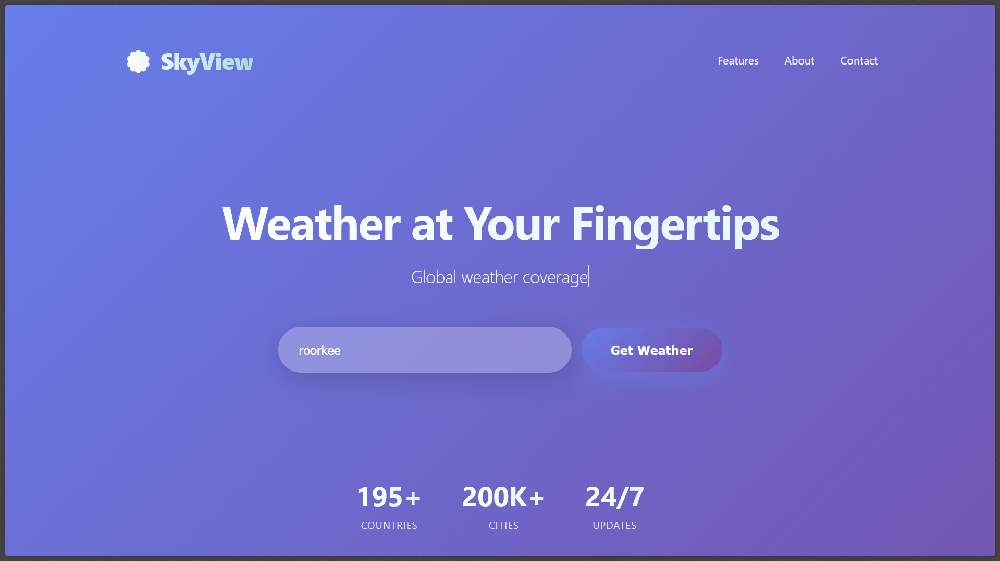
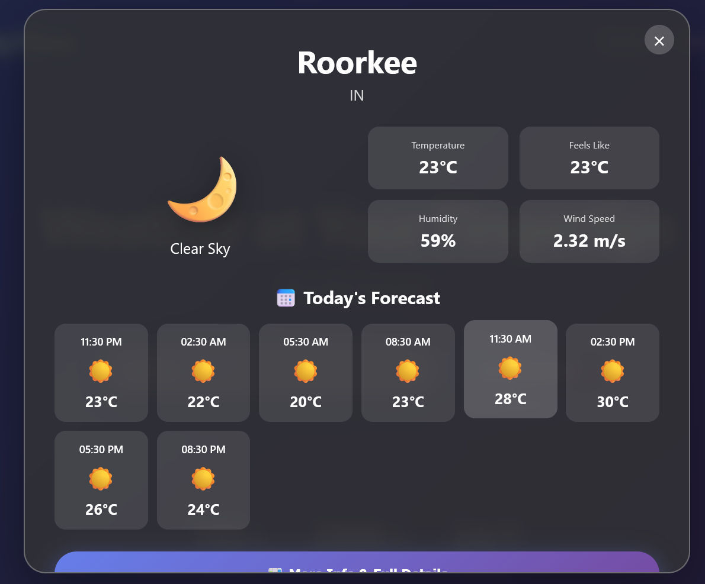

# ☀️ SkyView Weather

A modern, interactive weather application that provides real-time weather information with stunning visual effects and dynamic backgrounds that adapt to weather conditions.


## 🌟 Features

### Core Weather Features
- **Real-Time Weather Data** - Get accurate current weather information for any city worldwide
- **3-Hour Forecast** - View detailed hourly predictions for the next 24 hours (8 intervals)
- **7-Day Weather Outlook** - Plan ahead with weekly forecasts showing daily highs and lows
- **Global Coverage** - Search weather for 200K+ cities across 195+ countries
- **Comprehensive Weather Metrics**
  - Temperature (current, feels like, min/max)
  - Humidity levels
  - Wind speed and direction
  - Atmospheric pressure
  - Visibility distance
  - Sunrise and sunset times
  - Cloud coverage
  - Coordinates (latitude/longitude)

### Visual Experience
- **Dynamic Weather Backgrounds** - Background colors change based on weather conditions and time of day
- **Animated Weather Effects**
  - Falling rain with realistic droplets
  - Snowfall with rotating snowflakes
  - Lightning flashes during thunderstorms
  - Moving clouds across the sky
  - Sun during daytime
  - Moon and stars at night
- **Time-Based Themes** - Automatically switches between day, afternoon, and night themes
- **Smooth Animations** - Elegant fade-in effects and transitions throughout the interface
- **Glassmorphism Design** - Modern frosted glass aesthetic with backdrop blur effects

### User Interface
- **Instant Popup View** - Quick weather overview without leaving the homepage
- **Detailed Results Page** - Comprehensive weather information in a dedicated view
- **Responsive Design** - Optimized for desktop, tablet, and mobile devices
- **Interactive Elements** - Hover effects and smooth transitions for better UX
- **Clean Navigation** - Easy access to Features, About, and Contact pages

## 🚀 Live Demo

[View Live Demo](ttps://sky-view-rizo.onrender.com)

## 📸 Screenshots

### Homepage


### Weather Popup


### Detailed Weather View


## 🛠️ Technologies Used

- **HTML5** - Semantic markup structure
- **CSS3** - Advanced styling with animations, gradients, and backdrop filters
- **JavaScript (Vanilla)** - Dynamic content and API interactions
- **OpenWeatherMap API** - Real-time weather data
- **Responsive Design** - Mobile-first approach

## 📦 Installation

### Prerequisites
- A modern web browser (Chrome, Firefox, Safari, Edge)
- OpenWeatherMap API key (free tier available)

### Setup Steps

1. **Clone the repository**
   ```bash
   git clone https://github.com/yourusername/skyview-weather.git
   cd skyview-weather
   ```

2. **Get your API Key**
   - Visit [OpenWeatherMap](https://openweathermap.org/api)
   - Sign up for a free account
   - Generate an API key from your account dashboard

3. **Configure API Key**
   - Open `index.html` in a text editor
   - Find the line: `const API_KEY = 'b0207d006cd00a18ed7b73c87a8772b9';`
   - Replace with your API key: `const API_KEY = 'YOUR_API_KEY_HERE';`
   - Repeat for `results.html`

4. **Launch the Application**
   - Simply open `index.html` in your web browser
   - Or use a local server:
     ```bash
     # Using Python 3
     python -m http.server 8000
     
     # Using Node.js (http-server)
     npx http-server
     ```
   - Navigate to `http://localhost:8000`

## 📁 Project Structure

```
skyview-weather/
│
├── index.html          # Homepage with search and quick weather popup
├── results.html        # Detailed weather information page
├── features.html       # Feature showcase page
├── about.html          # About page with project and creator info
├── contact.html        # Contact form page
├── README.md           # Project documentation
└── screenshots/        # Screenshots for documentation
    ├── homepage.png
    ├── popup.png
    └── detailed.png
```

## 🎯 Usage

### Search for Weather
1. Enter any city name in the search box on the homepage
2. Click "Search" or press Enter
3. View instant weather information in the popup modal

### View Detailed Information
1. After searching for a city, click "More Info & Full Details" in the popup
2. Opens a new tab with comprehensive weather data
3. Includes hourly forecast and 7-day outlook

### Navigate Pages
- **Features** - Learn about all available features
- **About** - Project information and creator details
- **Contact** - Get in touch via contact form

## 🌤️ Weather Conditions

The app recognizes and displays effects for:
- ☀️ Clear Sky
- ☁️ Cloudy
- 🌧️ Rain / Drizzle
- ⛈️ Thunderstorm
- ❄️ Snow
- 🌫️ Mist / Fog / Haze

## 🎨 Customization

### Change Color Scheme
Modify the gradient colors in the CSS:
```css
body {
  background: linear-gradient(135deg, #667eea 0%, #764ba2 100%);
}
```

### Adjust Weather Effects
- Rain: Modify raindrop count in `createRain()` function
- Snow: Adjust snowflake count in `createSnow()` function
- Lightning: Change flash frequency in `createLightning()` function

### Temperature Units
To switch between Celsius and Fahrenheit, change the API parameter:
```javascript
// Celsius (default)
const url = `${API_URL}?q=${city}&appid=${API_KEY}&units=metric`;

// Fahrenheit
const url = `${API_URL}?q=${city}&appid=${API_KEY}&units=imperial`;
```

## 🔑 API Information

This project uses the OpenWeatherMap API:
- **Current Weather Data** - `/data/2.5/weather`
- **5-Day Forecast** - `/data/2.5/forecast` (3-hour intervals)

Free tier includes:
- 60 calls per minute
- 1,000,000 calls per month
- Current weather data
- 5-day / 3-hour forecast

[API Documentation](https://openweathermap.org/api)

## 🤝 Contributing

Contributions are welcome! Here's how you can help:

1. Fork the repository
2. Create a feature branch (`git checkout -b feature/AmazingFeature`)
3. Commit your changes (`git commit -m 'Add some AmazingFeature'`)
4. Push to the branch (`git push origin feature/AmazingFeature`)
5. Open a Pull Request

### Ideas for Contribution
- Add more weather effects
- Implement geolocation for automatic location detection
- Add weather alerts and warnings
- Create weather comparison feature
- Add historical weather data
- Implement dark/light mode toggle

## 🐛 Known Issues

- Weather effects may impact performance on older devices
- Results page requires city parameter in URL (no direct access)
- API rate limiting applies (60 calls/minute on free tier)

## 📝 License

This project is licensed under the MIT License - see the [LICENSE](LICENSE) file for details.

## 👨‍💻 Author

**Kartik Pandey**
- GitHub: [@kartikbhai23](https://github.com/kartikbhai23)
- LinkedIn: [Kartik Pandey](https://linkedin.com/in/kartikpandey)
- Website: [kartikpandey.me](https://kartikpandey.me)
- Email: kartikpandey.me@gmail.com

## 🙏 Acknowledgments

- Weather data provided by [OpenWeatherMap](https://openweathermap.org)
- Icons and emojis from Unicode Standard
- Design inspiration from modern weather applications
- Background gradient ideas from [UI Gradients](https://uigradients.com)

## 📊 Project Stats

- **Lines of Code**: ~2,500+
- **Files**: 5 HTML pages
- **Weather Conditions Supported**: 10+
- **API Endpoints Used**: 2
- **Animations**: 15+ custom animations
- **Responsive Breakpoints**: 2 (768px, 480px)

## 🔮 Future Enhancements

- [ ] Weather maps integration
- [ ] Air quality index (AQI)
- [ ] UV index information
- [ ] Pollen count data
- [ ] Weather radar
- [ ] Save favorite locations
- [ ] Weather widgets
- [ ] Push notifications for weather alerts
- [ ] Multi-language support
- [ ] Voice search capability

## 📞 Support

If you encounter any issues or have questions:
1. Check the [Issues](https://github.com/yourusername/skyview-weather/issues) page
2. Create a new issue with detailed information
3. Contact via email: kartikpandey.me@gmail.com

---

<div align="center">
  <p>Made with ❤️ by Kartik Pandey</p>
  <p>⭐ Star this repository if you found it helpful!</p>
</div>